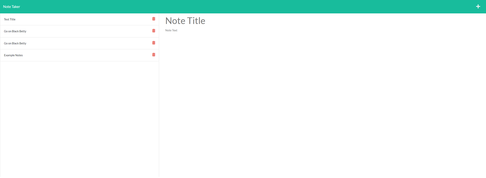

# Taker-of-Thy-Notes

  ## Description
  Hello, This is a note taking application that allows you create and save notes to a Database. You Click on the new note title to create and once the new note is created you simply press the save icon to save the note. After you have multiple notes added you can always go back and review by clicking on that particular note in the left hand column. From there the note you selected will appear in the righthand column.
 
  
  ## Table of contents
  
  - [license](#license)
- [installation](#installation)
- [usage](#usage)
- [contributing](#contributing)
- [questions](#questions)

  
  
  ## License
  None
  

  ## Installation
You will need to run npm i (install) when you open your terminal to install the needed packages for this application.
  

## Usage
Open terminal if not already open.
After all packages are installed you will type  node server js  .
Once the app is listening to the local host you will controle click the link in the terminal to open the application.
From there you can create notes and save them or delete them.

## Contributing
You may fork this repository and create pull request wth ideals on how to better this application .

## Questions
If any questions regarding this repository feel free to contact me via email at z19s96p@aol.com or GitHub Zachary-Maddox. 
